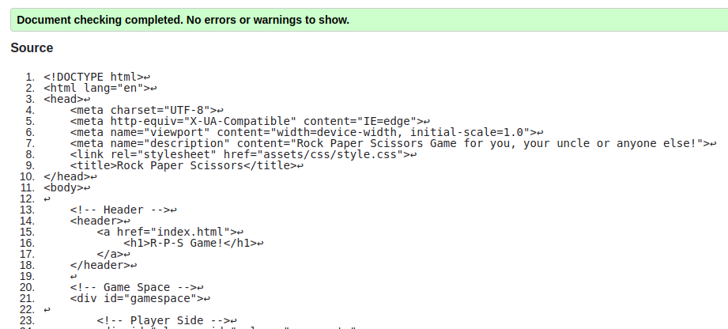
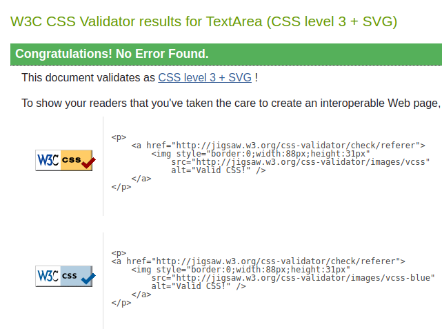
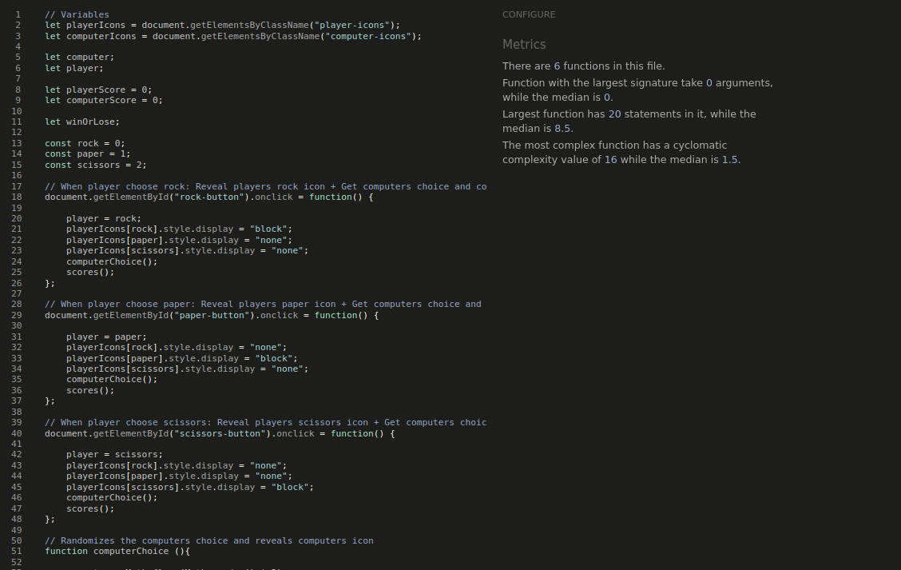

# Rock Paper Scissors

A Rock Paper Scissors Game for you, your uncle or anyone else!

Link to my [Github Repo](https://github.com/Rasmus-Dahlkvist/rock-paper-scissors)

Link to my [Live Site](https://rasmus-dahlkvist.github.io/rock-paper-scissors/)

---
## Features

### This site offers:
#### The Header
- Turns yellow when hovered.
- Reloads page when clicked.

#### Gameplay Area
- The gameplay area contains three sections.
- I used rgba colors to make gameplay area a little transparent just for good looks.

- Player section :
    - Uses blue background.
    - Is assigned to the player.
    - Displays current player score.
    - Displays if you won or lost this round.
    - Displays your choice with yellow hand icon.

- Computer section :
    - Uses red background.
    - Is assigned to the computer.
    - Displays current computer score.
    - Displays if computer won or lost this round.
    - Displays computers choice with yellow hand icon.

- Controls section :
    - Uses gray background.
    - Is located just beneath player and computer sections.
    - Contains three buttons styled as rock, paper and scissors hand icons.
    - Starts game when one of the buttons are clicked.
    - Buttons turn yellow when hovered.

- Pop-ups displaying if you won or lost the game
    - Pop-up gives you the option to Cancel to wiew your points or Ok to play again.

    

#### Rules
- First we have a yellow text prompting user to click the hand-buttons
- The rules are simple and displayed in white :
    - Rock beats Scissors
    - Paper beats Rock
    - Scissors beats Paper
    - First to 5 points win the game.

#### Footer
- At the bottom of the page we have a simple footer that contains :
    - A font icon link to [GitHub](https://github.com/Rasmus-Dahlkvist)
    - A font icon link to [LinkedIn](https://www.linkedin.com/in/rasmus-dahlkvist-b11670247/)
    - Links turn yellow when hovered. 

---

## Testing

- This site has been tested in devtools for big and small screens in firefox and chrome
- I have tested the site on a samsung galaxy tablet in chrome
- And also on my samsung xcover 5 in chrome and duckduckgo

### Bugs
1. My wood background picture did not load when site was deployed
2. Hand icon buttons were too big for some small mobile screens
3. lighthouse test showed 88 accessability
4. lighthouse test showed 91 on SEO
5. Got several warnings on w3c html validator ( Had the same id in several places )

### Fixed bugs
1. changed from /assets/images/wood.webp to ../images/wood.webp
2. changed font size and margin
3. Add aria-label, type and value to fonticon hand buttons
4. Add meta description
5. Remove ids and use class instead

### Validator Testing
Using W3C validators for testing html and css.
- index.html

- style.css

- script.js 

Using Lighthouse in devtools for testing accessibility on index.html

## Deployment

---

This site was deployed using github pages.

When you are in the repository you want to deploy:
1. Click on "Settings"
2. Click on "Pages"
3. Find Build and deployment
4. In the Source dropdown menu select "Deploy from a branch"
5. In the Branch dropdown menus select "main" and "/(root)"
6. Click Save
7. Wait 5 minutes
8. Refresh page
9. Now you should have a link

This is my live link - [R-P-S Game!](https://rasmus-dahlkvist.github.io/rock-paper-scissors/)

## Fork Repo

When you are in the repository you want to fork:

Locate the "Fork" button on the top right of the page and click it

## Create Local Clone
1. Under the repository name, click on the ‘code’ tab
2. In the clone box, HTTPS tab, click on the clipboard icon
3. In your IED open GitBash
4. Changed the current working directory to the location you want the cloned directory to be made
5. Type ‘git clone’ and then paste the URL copied from GitHub
6. Press enter and the local clone will be created

## Credits

---

### Content
- The html and css code for this project as well as the font icons, colors and styles was inspired from my first portfolio project as well as [W3Schools](https://www.w3schools.com/).
So i will start by giving myself some credit for coming such a long way since the beginning of my first portfolio project.
- The JavaScript for this project was largely based on [W3Schools](https://www.w3schools.com/) tutorials and the help of my friend Martin for explaining difficult concepts.
-
-
-
-

### Image
-

### Font Icons
-

### Colors