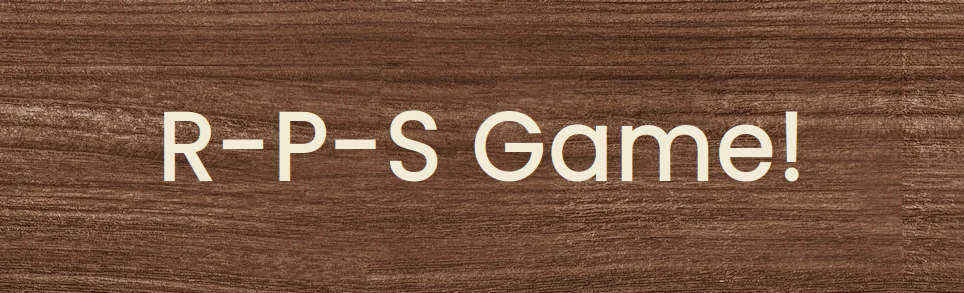
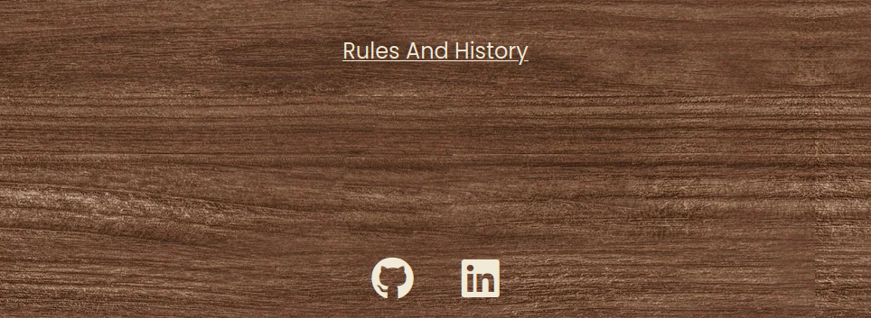

# R-P-S Game!

Rock Paper Scissors Game for you, your uncle or anyone else!

Link to my [Github Repo](https://github.com/Rasmus-Dahlkvist/rock-paper-scissors)

Link to my [Live Site](https://rasmus-dahlkvist.github.io/rock-paper-scissors/)

---
## Features

### This site offers:
#### The Header
- Turns yellow when hovered.
- Reloads page when clicked.

#### Gameplay Area
- The gameplay area contains three sections.
- I used rgba colors to make gameplay area a little transparent just for good looks.

- Player section :
    - Uses blue background.
    - Is assigned to the player.
    - Displays current player score.
    - Displays if you won or lost this round.
    - Displays your choice with yellow hand icon.

- Computer section :
    - Uses red background.
    - Is assigned to the computer.
    - Displays current computer score.
    - Displays if computer won or lost this round.
    - Displays computers choice with yellow hand icon.

- Controls section :
    - Uses gray background.
    - Is located just beneath player and computer sections.
    - Contains three buttons styled as rock, paper and scissors hand icons.
    - Starts game when one of the buttons are clicked.
    - Buttons turn yellow when hovered.

- Pop-ups displaying if you won or lost the game
    - Pop-up gives you the option to Cancel to wiew your points or Ok to play again.

    

#### Rules Link and footer
- Just beneath the gameplay area we have a 
[Rules And History](https://en.wikipedia.org/wiki/Rock_paper_scissors) link that open up wikipedia in a new tab.

- At the bottom of the page we have a simple footer that contains :
    - A font icon link to [GitHub](https://github.com/Rasmus-Dahlkvist)
    - A font icon link to [LinkedIn](https://www.linkedin.com/in/rasmus-dahlkvist-b11670247/)

    - Links turn yellow when hovered. 

---

## Testing

### Bugs
1. My wood background picture did not load when site was deployed
2. Hand icon buttons were too big for some small mobile screens
3. lighthouse test showed 88 accessability
4. lighthouse test showed 91 on SEO
5.
6. This is not really a bug but when in testing i turned off my adblock program and realised that the 
[Old Link](https://wrpsa.com/the-official-rules-of-rock-paper-scissors/) was totally destroyed by inappropriate ads.

### Fixed bugs
1. changed from /assets/images/wood.webp to ../images/wood.webp
2. changed font size and margin
3. Add aria-label, type and value to fonticon hand buttons
4. Add meta description
5.
6. changed to a wikipedia link instead *insert link*

### Unfixed bugs
1. want to make a function so that the winning side get a font icon thumbs up and losing side get a font icon thumbs down (not really a bug)
2.
3.

